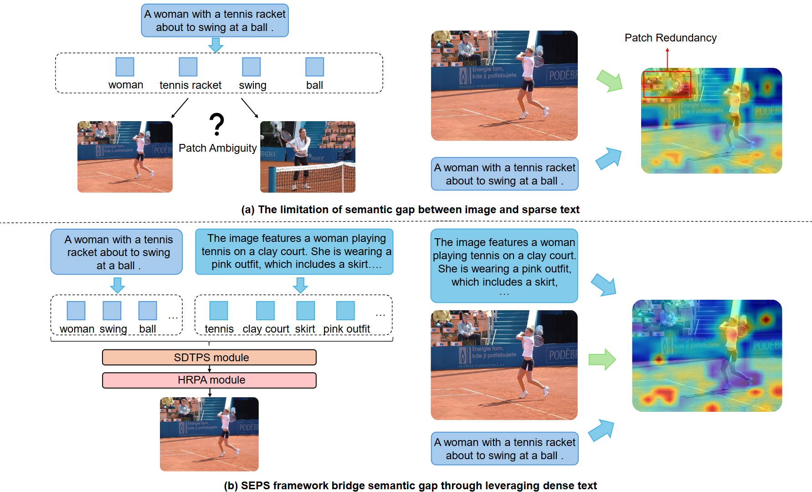
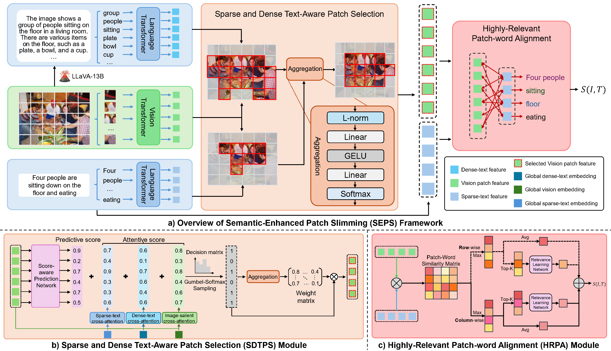

# SEPS: Semantic-enhanced Patch Slimming Framework for fine-grained cross-modal alignment

We referred to the implementations of [LAPS](https://github.com/CrossmodalGroup/LAPS) and [D2S-VSE](https://github.com/liuyyy111/d2s-vse) to build up the repository. Our paper is at [here](https://arxiv.org/abs/2511.01390).


## Introduction
Cross-modal alignment methods universally face the fundamental challenge of bridging the information gap between modalities. This gap stems from the contrasting nature of cross-modal information representation: visual inputs provide dense, continuous spatial information, while textual descriptions offer sparse, discrete semantic anchors that capture only salient scene aspects. With Vision Transformer (ViT) based models becoming mainstream through efficient patch-based image processing in fine-grained alignment methods, this information gap manifests itself as two problems: patch redundancy, where numerous visual patches contain overlapping or irrelevant information with no explicit textual counterparts, and patch ambiguity, where sparse textual elements are difficult to map reliably to individual patches. These problems particularly impair text-to-image retrieval performance in complex visual scenarios.

<div align=center>

</div>

Recently, Multimodal Large Language Models (MLLMs) have emerged as promising solutions to bridge this semantic gap through their robust semantic generation capabilities. However, the integration of MLLMs introduces new challenges: the dense textual outputs generated by MLLMs may conflict with original sparse captions, as the comprehensive semantic descriptions from MLLMs can introduce semantic inconsistencies with existing concise annotations, potentially causing confusion in cross-modal alignment and degrading retrieval performance.
Additionally, accurately quantifying semantic relevance between rich visual patches and concise textual descriptions remains challenging, as conventional alignment methods rely on global averaging, failing to recognize that only a subset of patches are semantically relevant, thus allowing irrelevant regions with low similarity scores to dilute the overall alignment quality.
In this paper we argue that richer semantic guidance is key and propose the Semantic-Enhanced Patch Slimming (SEPS) framework. Our framework aggregates both sparse and dense textual representations to identify semantically relevant patches, and employs top-k selection with mean value computation to emphasize critical patch-word correspondences.

To overcome these limitations, we introduce the Semantic-Enhanced Patch Slimming (SEPS) framework, which systematically addresses both patch redundancy and ambiguity through strategic MLLM integration. Our key insight revolves around employing a two-stage mechanism that integrates unified semantics derived from both dense MLLM-generated texts and sparse original captions to identify salient visual patches, where dense texts serve as contextual assistance while sparse texts act as specific queries for patch selection.

Specifically, as illustrated in the second figure, our framework operates through a comprehensive pipeline: we first extract visual patches alongside both sparse-text and dense-text feature representations, then aggregate semantically selected visual patches through Sparse and Dense Text-Aware Patch Selection (SDTPS) module, which makes informed selection decisions based on complementary textual perspectives. Finally, we employ our Highly-Relevant Patch-Word Alignment (HRPA) module with relevance-aware selection and mean value computation to facilitate nuanced fine-grained interactions, amplifying highly-relevant patch-word correspondences and improving alignment quality.

Extensive experiments on Flickr30K and MS-COCO datasets demonstrate that SEPS achieves state-of-the-art performance, outperforming existing methods by 23\%-86\% in rSum across various model backbones, with particularly significant improvements in text-to-image retrieval tasks.

<div align=center>

</div>


## Preparation

### Environments
We recommended the following dependencies:
- python >= 3.8
- torch >= 1.12.0
- torchvision >= 0.13.0
- transformers >=4.32.0
- opencv-python
- tensorboard


### Datasets

We have prepared the caption files for two datasets in  `data/` folder, hence you just need to download the images of the datasets. 
The Flickr30K (f30k) images can be downloaded in [flickr30k-images](https://www.kaggle.com/datasets/hsankesara/flickr-image-dataset). The MSCOCO (coco) images can be downloaded in [train2014](http://images.cocodataset.org/zips/train2014.zip), and [val2014](http://images.cocodataset.org/zips/val2014.zip).
We hope that the final data are organized as follows:


```
data
├── coco  # coco captions
│   ├── coco_testall.jsonl
│   ├── coco_train.jsonl
│   ├── train_ids.txt
│   ├── train_caps.txt
│   ├── testall_ids.txt
│   ├── testall_caps.txt
│   └── id_mapping.json
│
├── f30k  # f30k captions
│   ├── f30k_test.jsonl
│   ├── f30k_train.jsonl
│   ├── train_ids.txt
│   ├── train_caps.txt
│   ├── test_ids.txt
│   ├── test_caps.txt
│   └── id_mapping.json
│
├── flickr30k-images # f30k images
│
├── coco-images # coco images
│   ├── train2014
│   └── val2014
```


### Model Weights

Our framework needs to get the pre-trained weights for [BERT-base](https://huggingface.co/bert-base-uncased), [ViT-base](https://huggingface.co/google/vit-base-patch16-224-in21k), and [Swin-base](https://huggingface.co/microsoft/swin-base-patch4-window7-224) models. 
You also can choose the weights downloaded by [transformers](https://github.com/huggingface/transformers) automatically (the weights will be downloaded at  `~/.cache`).


## Training
First, we set up the **arguments**, detailed information about the arguments is shown in ```arguments.py```.

- `--dataset`: the chosen datasets, e.g., `f30k` and `coco`.
- `--data_path`: the root path of datasets, e.g., `data/`.
- `--multi_gpu`: whether to use the multiple GPUs (DDP) to train the models.
- `--gpu-id`, the chosen GPU number, e.g., 0-7.
- `--logger_name`, the path of logger files, e.g., `runs/f30k_test` or `runs/coco_test`


Then, we run the ```train.py``` for model training. 
The models need about 20,000 GPU-Memory (one 3090 GPU) when batch size = 64 and about 40,000 GPU-Memory (one A40 GPU) when batch size = 108.
You need to modify the batch size according to the hardware conditions, and we also support the **multiple GPUs** training. 
Besides, considering the GPU-memory limitation, we don't integrate the Gumbel-softmax sampling for the patch selection in the repository. 
The performances are not affected much but GPU-memory is reduced a lot (see more details in the paper).

```
## single GPU

### vit + f30k 
python train.py --dataset f30k --gpu-id 0 --logger_name runs/f30k_vit --batch_size 64 --vit_type vit --embed_size 512 --sparse_ratio 0.5 --aggr_ratio 0.4

### swin + f30k
python train.py --dataset f30k --gpu-id 0 --logger_name runs/f30k_swin --batch_size 64 --vit_type swin  --embed_size 512 --sparse_ratio 0.8 --aggr_ratio 0.6

### vit + coco 
python train.py --dataset coco --gpu-id 0 --logger_name runs/coco_vit --batch_size 64 --vit_type vit --embed_size 512 --sparse_ratio 0.5 --aggr_ratio 0.4

### swin + coco
python train.py --dataset coco --gpu-id 0 --logger_name runs/coco_swin --batch_size 64 --vit_type swin  --embed_size 512 --sparse_ratio 0.8 --aggr_ratio 0.6


## multiple GPUs

### vit + f30k
CUDA_VISIBLE_DEVICES=0,1 python -m torch.distributed.run --nproc_per_node=2 train.py --dataset f30k --multi_gpu 1 --logger_name runs/f30k_vit --batch_size 64 --vit_type vit --embed_size 512 --sparse_ratio 0.5 --aggr_ratio 0.4

### swin + f30k
CUDA_VISIBLE_DEVICES=0,1 python -m torch.distributed.run --nproc_per_node=2 train.py --dataset f30k --multi_gpu 1 --logger_name runs/f30k_swin --batch_size 64 --vit_type swin --embed_size 1024 --sparse_ratio 0.8 --aggr_ratio 0.6


### vit + coco
CUDA_VISIBLE_DEVICES=0,1,2,3 python -m torch.distributed.run --nproc_per_node=4 train.py --dataset coco --multi_gpu 1 --logger_name runs/coco_vit --batch_size 64 --vit_type vit --embed_size 512 --sparse_ratio 0.5 --aggr_ratio 0.4

### swin + coco
CUDA_VISIBLE_DEVICES=0,1,2 python -m torch.distributed.run --nproc_per_node=3 train.py --dataset coco --multi_gpu 1 --logger_name runs/coco_swin --batch_size 72 --vit_type swin --embed_size 512 --sparse_ratio 0.8 --aggr_ratio 0.6
CUDA_VISIBLE_DEVICES=0,1,2,3 python -m torch.distributed.run --nproc_per_node=4 train.py --dataset coco --multi_gpu 1 --logger_name runs/coco_swin --batch_size 64 --vit_type swin --embed_size 512 --sparse_ratio 0.8 --aggr_ratio 0.6
```

## Evaluation
Run ```eval.py``` to evaluate the trained models on f30k or coco datasets, and you need to specify the model paths.

```
python eval.py --dataset f30k --data_path data/ --gpu-id 0
python eval.py --dataset coco --data_path data/ --gpu-id 1
```


## Performances
The following tables show the reproducing results of cross-modal retrieval on **MSCOCO** and **Flickr30K** datasets. 
We provide the training logs, checkpoints, performances, and hyper-parameters.

|Datasets| Visual encoders |I2T R@1|I2T R@5|T2I R@1|T2I R@5| rSum | Model checkpoint and train log|
|:---:|:---:|:---:|:---:|:---:|:---:|:---:|:---:|
|Flickr30K |ViT-224 | 86.1 | 93.7  | 86.9 | 98.1 | 560.9 |[Link](https://drive.google.com/drive/folders/1muHqWyKgzyDQ4fqSo5QgRPtXLTJEVdbZ?usp=drive_link)|
|Flickr30K |ViT-384 | 90.7 | 94.4  | 89.3 | 99.3 | 571.5 |[Link](https://drive.google.com/drive/folders/1iUVqFBj1odFvrAjxyF_QNgpw-DDf-Za_?usp=drive_link)|
|Flickr30K |Swin-224 | 89.8 | 96.9 | 88.0 | 98.9 | 572.0 |[Link](https://drive.google.com/drive/folders/1YUZ10szYk5hnvzz8rfCAcV1ai1_bd3wH?usp=drive_link)|
|Flickr30K |Swin-384 | 93.6 | 98.3 | 91.6 | 99.4 | 581.9 |[Link](https://drive.google.com/drive/folders/1_YDDBH2F_HnoBTQGTvogXlrEKaTIFq0G?usp=drive_link)|
|MSCOCO-1K |ViT-224 | 89.0 | 94.8  | 88.5 | 99.3  | 569.5 |[Link](https://drive.google.com/drive/folders/1eRgjDuGYAdnqHB2l3EvVeJmfkS9GhmaV?usp=drive_link)|
|MSCOCO-1K |ViT-384 | 90.9 | 96.1  | 91.0 | 99.5 | 576.1 |[Link](https://drive.google.com/drive/folders/1WuY6cyZBK7ImzFkni3YeLRN_2x7z-2E3?usp=drive_link)|
|MSCOCO-1K |Swin-224 | 87.2 | 94.9 | 84.7 | 99.0 | 563.9 |[Link](https://drive.google.com/drive/folders/1lV6E9D-3IVZMY79acSRbVp66HQSs2gqC?usp=drive_link)|
|MSCOCO-1K |Swin-384 | 89.5 | 96.5 | 87.1 | 99.2 | 571.2 |[Link](https://drive.google.com/drive/folders/1x-szyZmRFPHatwoUk9x-mQU5NWf7SVc3?usp=drive_link)|
|MSCOCO-5K |ViT-224 | 73.9 | 85.2 | 73.5 | 94.5 | 516.9 |[Link](https://drive.google.com/drive/folders/1eRgjDuGYAdnqHB2l3EvVeJmfkS9GhmaV?usp=drive_link)|
|MSCOCO-5K |ViT-384 | 77.8 | 88.7 | 78.5 | 96.3  | 534.6 |[Link](https://drive.google.com/drive/folders/1WuY6cyZBK7ImzFkni3YeLRN_2x7z-2E3?usp=drive_link)|
|MSCOCO-5K |Swin-224 | 71.9 | 86.0  | 66.8 | 92.2 | 506.1 |[Link](https://drive.google.com/drive/folders/1lV6E9D-3IVZMY79acSRbVp66HQSs2gqC?usp=drive_link)|
|MSCOCO-5K |Swin-384 | 74.7 | 88.4  | 70.3 | 93.8 | 519.1 |[Link](https://drive.google.com/drive/folders/1x-szyZmRFPHatwoUk9x-mQU5NWf7SVc3?usp=drive_link)|


